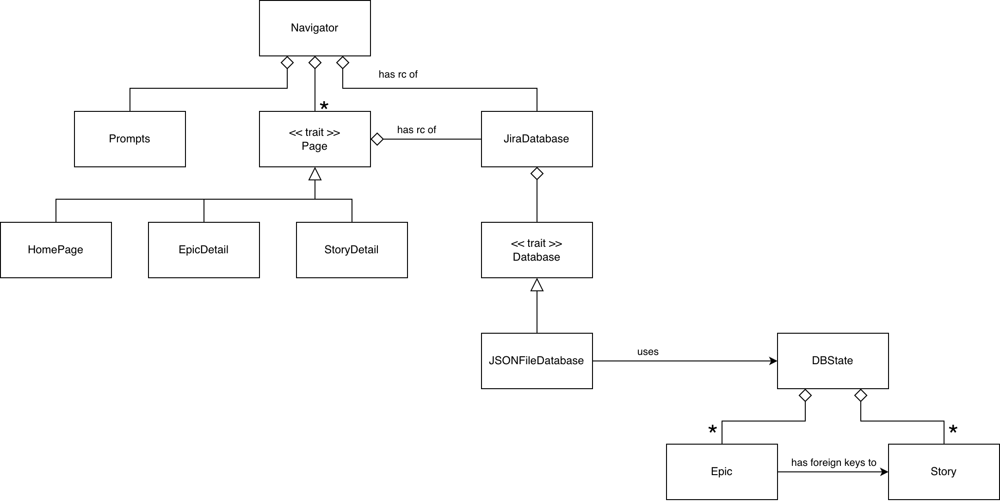

# My Jira CLI

This is a simple [Jira](https://www.atlassian.com/software/jira)-like project management CLI app built in Rust.

## What This App Does

This app models 2 entities:

- `Epic`, i.e. project
- `Story`, i.e. task

An `Epic` may contain 0 or more `Stories`.

In this app, you can perform CRUD operations on Epic and Story entities, and the data is persisted as a JSON file.

## Developer Notes

### Entity Relationship Diagram

